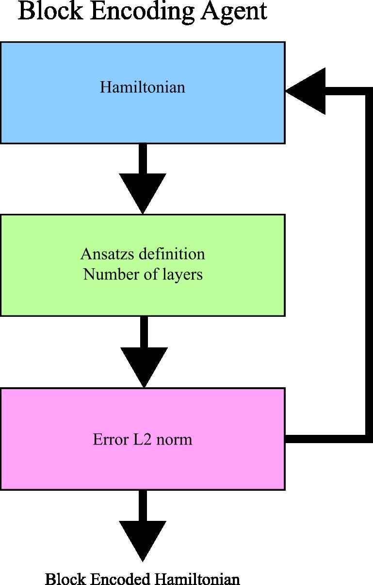

# Block Encoding Agent - Version 0.1:
 
The main idea of this agent is to be able to find an efficient block encoding of a given (most likely) non-unitary operator H. 
The agent will generate differents set of ansatz and optimice to find base on the following metrics.

- Reducing T gates.
- Reducing depth.
- Reducing the number of two-qubit gates.

At first, we will focus on generating such block-encoding with one extra ancilla qubit.
This is a pilot agent to test how to create agents and optimize to generate more agents in the future.
The current implementation lacks many of the important factors of the agent but I will soon update. 

Future improvements:
- The agent should be able to change the ansatz at will.
- The agent should be able to save the plotting circuit of the given best ansatz for such block encoding.

The following figure is the current workflow. Still missing different implementations.

    

